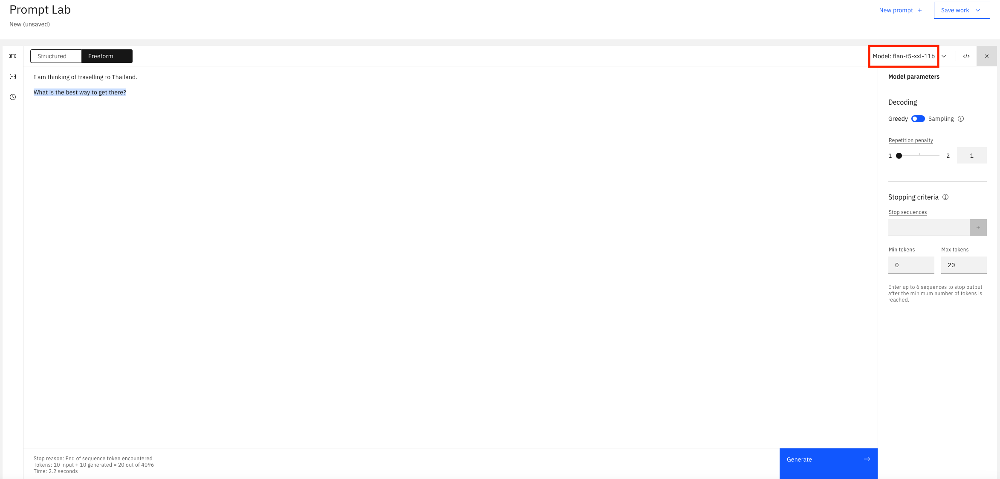
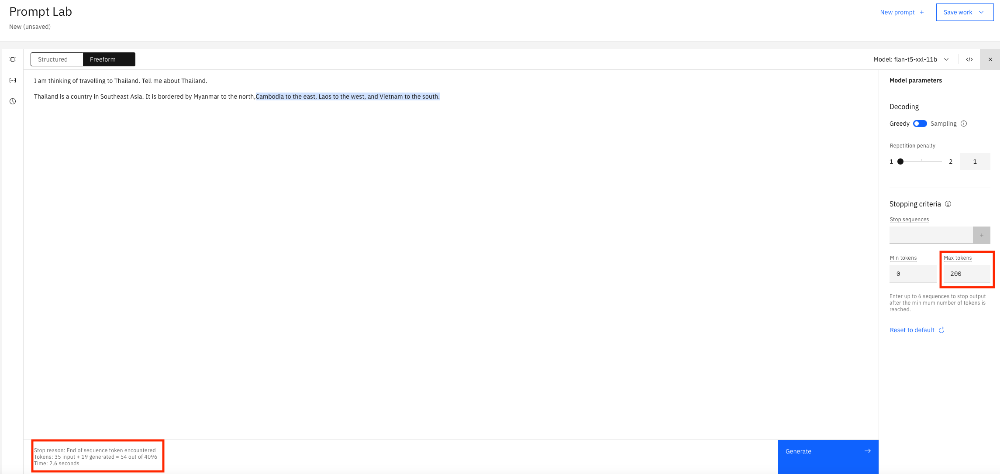
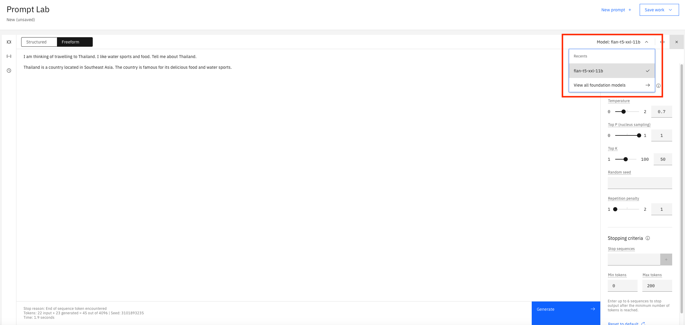
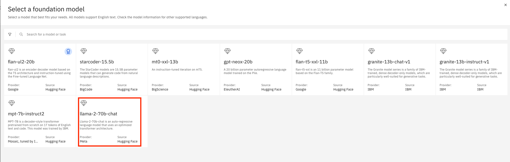
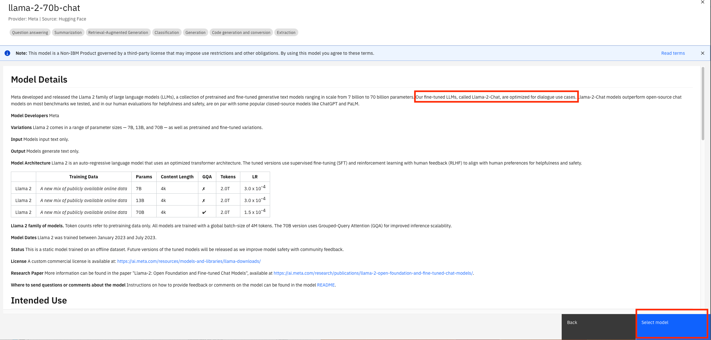
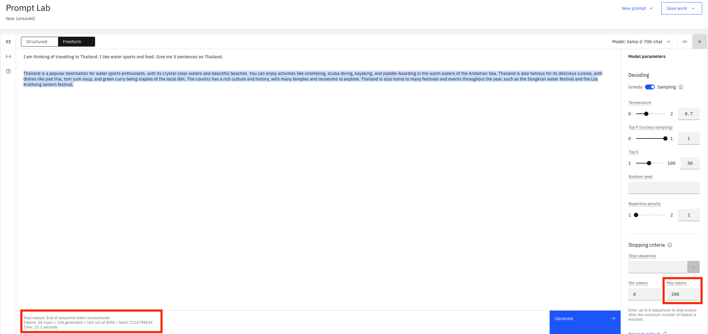
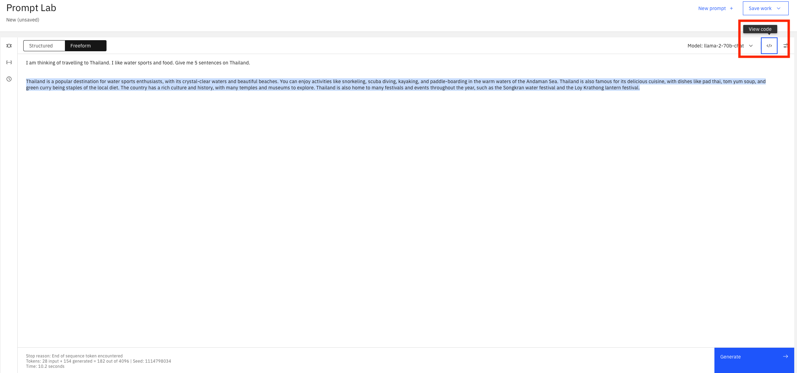

# Using Prompt Engineering to Identify the LLM for your Application

[Generative AI](https://research.ibm.com/blog/what-is-generative-AI) refers to deep-learning models that can generate high-quality text, images, and other content based on the data they were trained on. A [Large Language Model (LLM)](https://en.wikipedia.org/wiki/Large_language_model) is a type of language model notable for its ability to achieve general-purpose language understanding and generation. The goal of this lab is to show how you can use [prompt engineering](https://en.wikipedia.org/wiki/Prompt_engineering) with LLMs in order to elicit more accurate, relevant, and context-aware responses. The specfic responses we want to get is travel information on countries which we want to levergae when building the application in the next lab, lab 2.

**Note:** The following images show actual results from [watsonx.ai](https://www.ibm.com/products/watsonx-ai) prompt lab. The slight gray text is what we provided to the model.  The blue highlighted text is how the model responded. Be aware that the outputs shown here may not exactly resemble the outputs you receive when using the prompt lab.

## Steps

## Step 1. Getting started

When you open up watsonx.ai prompt lab and click the `Freeform` mode-option, this is what you will be shown. The large central text area is the prompt editor. On the right-side, you can display the model parameters that you can use to select to optimize how the model responds to your prompt. On the bottom-left, is a summary of the number of tokens used by your prompt during execution. For more information on prompt engineering, see [watsonx prompt lab](https://github.com/IBM/watsonx-prompt-lab).

**Note:** The models provided in the prompt lab are [foundation models](https://research.ibm.com/topics/foundation-models) which are hosted on IBM cloud so we can [inference](https://research.ibm.com/blog/AI-inference-explained#) or call them. LLMs are a type of foundation model which we will use in this lab.

### Step 2. First prompt

When starting with the initial prompt, it's best to just try something quickly and if it doesn't give you the result you want, then go ahead and improve it over time. We will do this in a step by step process.

Lets start with:

- Model: `flan-t5-xxl-11b`
- Prompt text: `I am thinking of travelling to Thailand.`

This produces the following output when we call the model (in other words, click on the "Generate" button):

This however returns a response which is not very useful as we get no information on Thailand. This is analgous to questioning a person about a particular topic. The more open ended the questions, then the more generic the answers will be. However, the more closed the questions, then then more specific the answers. We therefore need to go again and provide more specfic context in the prompt to help direct the model to generate information about Thailand.

### Step 3. Being more direct

Lets be more direct in our prompt this time:

- Prompt text: `I am thinking of travelling to Thailand. Tell me about Thailand.`

This produces the following output when we call the model:

This is more promising as we are now getting some information on Thailand. However, it seems to finish in mid-sentence. The summary of the number of tokens (on the bottom-left) provide the following reason: `Stop reason: Max tokens parameter reached`. This means we do not have enough tokens to process the request. Tokens represent the smallest entity which is handled by the model architecture. For our discussion in this lab, we will view tokens as equivalent to words (see [Tokens and tokenization](https://www.ibm.com/docs/en/watsonx-as-a-service?topic=models-tokens) for a more exact definition of tokens). We therefore need to increase our "Max tokens".

### Step 4. Tinkering with model parameters

When we increase the "Max tokens" to `200` and run with the same prompt again, we will get output similar to the following:

This time it finished the sentence and the summary of the number of tokens reason reads as follows: `Stop reason: End of sequence token encountered`. All good from that aspect.

Every time we query the model however, it will return the same answer. This is because we are using `Greedy` "Decoding". This style of decoding asks the model to return what it thinks is the best or statistically the most accurate response always. Lets change "Decoding" to `Sampling` and see what the model returns with the same prompt each time.

You will now see different responses similar to the following:

Variety is the spice of life! There are more parameters which you can configure the model differently with but we will not cover them in this lab. See [watsonx prompt lab](https://github.com/IBM/watsonx-prompt-lab) for more details on parameters and how to use them.

### Step 5. Getting more specific

We have played around with the prompt text and the model parameters which has guided the model to return information on Thailand. It is however generic information and for the design of our travel app we would like to be able to provide information tailored to users interests. Lets therefore update the prompt text as follows to show information on "water sports and food": `I am thinking of travelling to Thailand. I like water sports and food. Tell me about Thailand.`.

This response is very limited and it should be more informative, to be useful in your application. We have tried different prompts and parameters but we still don't have the relevant information we require. Maybe the model we are using has limitations for our requirements. Is it time therefore to checkout out a different model?

### Step 6. Checking out other models

watsonx.ai prompt lab provides information cards on the models it supports. The card can provide information like:

- Provider and source of the model
- Tasks the model is best suited to
- How to tune the model
- White paper is is based on
- Bias, risks and limitation

The information provided depends on the model.

You can access the information on the models by clicking on the dropdown along side the model name, and selecting "View all foundation models" as follows:

Here is list of the models currently supported on the free tier prompt lab:

Click on the `llama-2-70b-chat` model to look at its information card:

There is an interesting piece of information highlighted which states that the model is "optimized for dialogue use cases". As we are trying to find a model to question for information, it looks like this model might be a good fit. Click on "Select model" buton and lets try the model out to see if it returns more information on Thailand.

### Step 7. Using a different model

We have now selected the `llama-2-70b-chat` model, and using the same prompt and parameters, lets see what it returns.

This definitely looks like an improvement but it looks like the response was cut-off, similar to a previous step. This is confirmed by `Stop reason: Max tokens parameter reached` comment in the summary of the number of tokens. As tokens increase so does the cost of calling a model. This time instead of just increasing the token size, it would be great if we had a less expensive alternative. This is what we will try in the next section.

### Step 8. Adding limits to the prompt

We will alter the prompt text by adding a limit to the response returned. In this way, we tell the model to return the response within the limit we define. The prompt text will now be altered to look like this: `I am thinking of travelling to Thailand. I like water sports and food. Give me 5 sentences on Thailand.`.

Finally, we have a response from our query on Thailand that is useful, informative and tailored to a user preferences. It is also within our max token size. We have a result!

## Conclusion and next steps

There is an alternative to training and creating a new model to fit your needs, and that is prompt tuning of a LLM. As you have seen in the lab we just did, it requies iterative testing and tweaking to find the model and prompt that suits your requirements. This is a simple example we are using but the same principles apply to other scenarios. It may require more context in the prompt, including using examples (shot prompting) to guide the response.

It was mentioned previously that the models are hosted on IBM Cloud and are inferenced/called when we click the "Generate" button. You can check the REST API that is called on the model by clicking on the "View code" dropdown as shown.

When you click on the "View code", you will see output similar to the following which shows all details of the API call including model name, prompt text, and parameters.

Now that we have identified the model, parameters and prompt that we will use, lets move onto lab 2 where we will build the application using this information.

