# Create your application which uses LLM to generate information

The goal of this lab is to show how you can leverage [Generative AI](https://research.ibm.com/blog/what-is-generative-AI) in an application to bring value to the app. The application we are going to create is a travel chatbot app, and we will use [watsonx Assistant](https://www.ibm.com/products/watsonx-assistant?cm_sp=ibmdev-_-developer-tutorials-_-product) to help simplify making the chatbot. For more information on creating chatbots using watsonx Assistant, check out the [watsonx chatbot lab](https://github.com/IBM/watsonx-chatbot-lab). As discussed in Lab 1, we will use a [Large Language Model (LLM)](https://en.wikipedia.org/wiki/Large_language_model) to generate the travel information.

## Steps

### Step 1. Obtain the OpenAPI definition of the watsonx.ai generation endpoint

Before you can add the integration between [watsonx.ai](https://www.ibm.com/products/watsonx-ai) and watsonx Assistant virtual assistant to enable a LLM to be called from the chatbot, you must use an OpenAPI definition for the watsonx.ai foundation model inferencing service. An example definition file is available in the [Assistant toolkit](https://github.com/watson-developer-cloud/assistant-toolkit/blob/master/integrations/extensions/starter-kits/language-model-watsonx/watsonx-openapi.json) GitHub repository. However, for this workshop, you'll use a version that is modified with additional support for the `decode_method` parameter of the API. Download this version of the [watsonx-openapi.json](files/watsonx-openapi.json) file to your workstation.

**Note:** `servers.url` property should be set to the same IBM Cloud region as where your watsonx.ai and watsonx Assistant are deployed to.

### Step 2. Add an empty virtual assistant to the watsonx Assistant instance

For initial experimentation with the integration, use a new virtual assistant. If you have a newly created watsonx Assistant service instance, it will not have any assistants defined. Create one using the **Create Assistant** wizard that uses the name `Travel App`, and then select `web` as the deployment location.

The values that you provide in the other parts of the wizard do not matter. For a slightly opinionated, step-by-step example of how to get a web assistant created, see the [Technical Sales watsonx Assistant 101 lab](https://vest.buildlab.cloud/en/watsonx/assistant/101) up to the point where you see the home page for the assistant. If you have other assistants defined already in your instance, add one by following the [Adding more assistants](https://cloud.ibm.com/docs/watson-assistant?topic=watson-assistant-assistant-add) documentation.

### Step 3. Create a watsonx.ai API key

If you have previously created an API key for calling watsonx.ai from a notebook or just the REST endpoint with `curl`, you can skip these steps and reuse that API key. Otherwise:

1. Log in to [watsonx.ai](https://dataplatform.cloud.ibm.com/wx/home?context=wx&cm_sp=ibmdev--developer--trial), and make sure that the same account as the Watson Machine Learning instance for your watsonx.ai project is selected.

2. To generate an API key from your IBM Cloud user account, go to [Manage access and users - API Keys](https://cloud.ibm.com/iam/apikeys), and click **Create**. In the pop-up window, provide a name like `watsonx-apikey` and a short description, then click **Create**.
   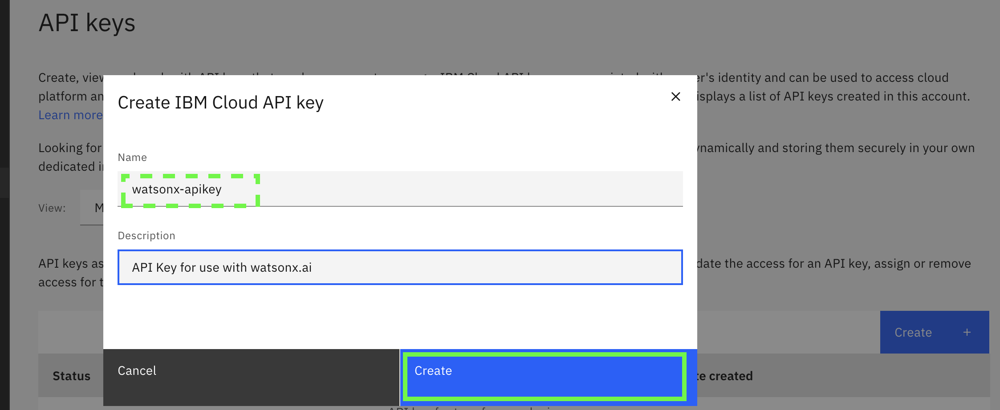

3. Immediately make a copy of the API key and store it in a secure location as there is no way to retrieve it again.

### Step 4. Getting your watsonx.ai project ID

1. In the watsonx.ai page, select the left 4-bar pull-down menu, expand **Projects**, and then click **View all projects**.

2. From the list, select the project that you are using for the integration.

3. Click the **Manage** tab, and ensure that **General** is selected. Copy the **Project ID** to a location where you can access it later. This is not sensitive like the API key, so it can be in a notepad or something equivalent.

   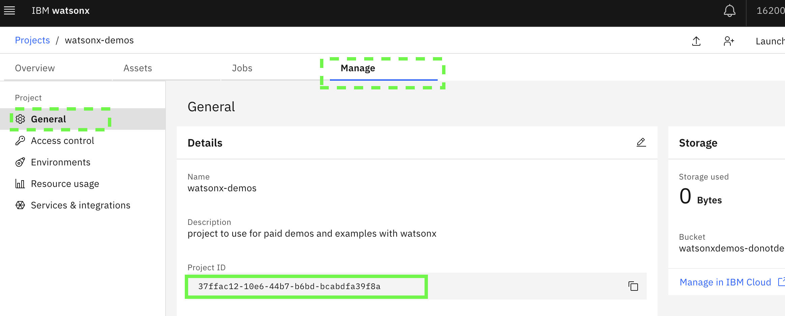

### Step 5. Add the custom extension for watsonx.ai to the Integrations catalog

1. Return to your browser tab with the assistant that you created. In the assistant left navigation panel, go down to the lower section and click **Integrations**.

2. Scroll down to the **Extensions** section, and click **Build custom extension**.
   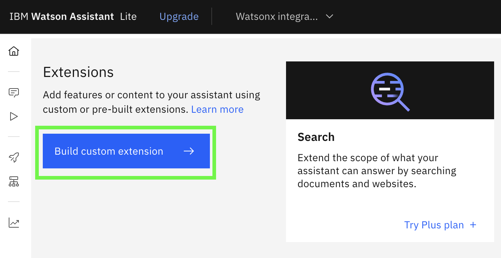

3. Review the getting started guide, and click **Next**.

4. On the basic information tab, name the extension `watsonx`, and provide an optional description. Click **Next**.

5. Either drag the file or use the file browser to select the `watsonx-openapi.json` file, and then click **Next**.
   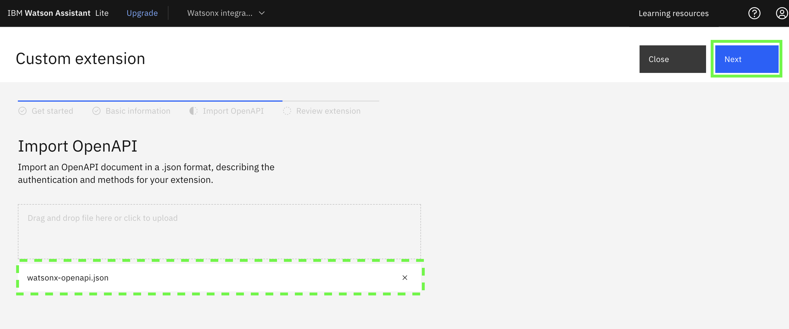

6. Review the information displayed, and click **Finish**. The integration catalog shows the integration.
   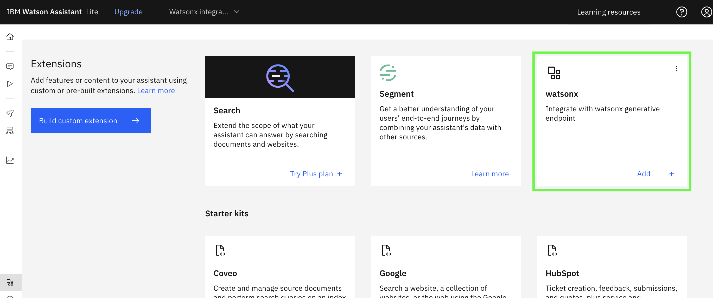

7. Click **Add** in the lower-right corner of the new integration tile, and confirm **Add** when prompted.

8. Review the Get Started information, and click **Next**.

9. In the Authentication panel, select `Oauth 2.0`, enter the API key that you created earlier, keep the remaining default values, then click **Next**.
   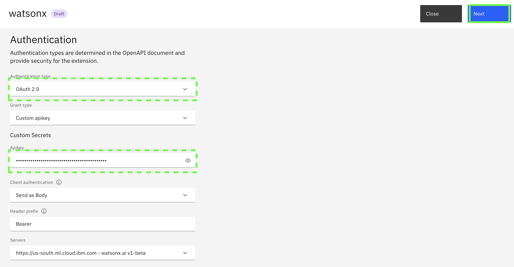

10. On the last page, review the `POST` request parameters and response values. The assistant can set parameters in the request before calling the extension and will parse the response to show the user the output. Click **Finish**, then click **Close** if you are not returned to the **Extensions** section of the **Integrations** panel.

Congratulations, you now have a way to make a functional integration from an *Action* in an assistant with a watsonx generative AI endpoint. In other words, you now have the means to [inference](https://research.ibm.com/blog/AI-inference-explained) a LLM from a chatbot.

### Step 6. Create your action

Now, it's time to create your action and have it use the integration to watsonx. To get started, you create an action that uses generative AI to generate travel information from your prompt.

1. In the browser tab with watsonx Assistant, click **Actions** in the upper left.

2. In the main panel, click **Create action**.

3. Select **Start from Scratch**.

4. For what the customer says, enter `Travel`, and click **Save**.
   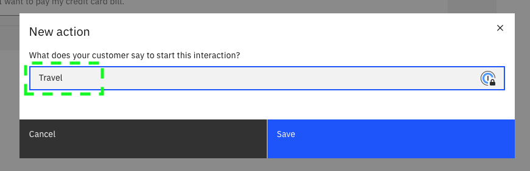

5. Click the pencil icon to set a step title. Use `Specify country` as the title.

6. For what the **Assistant says**, you can either make it a short message or be more prescriptive. Humans, can often do better when requests are specific. For example:
    "What country would you like to travel to?"
   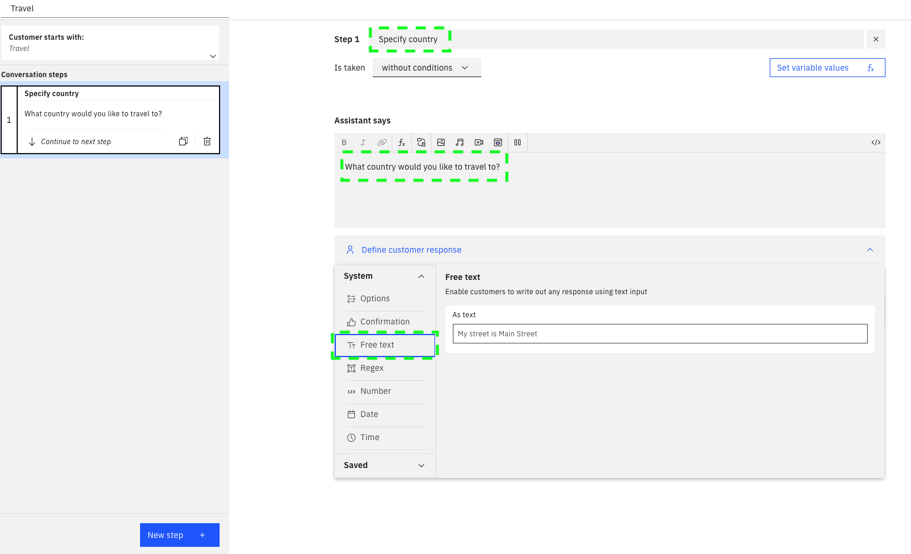
   Expand **Define customer response**, and specify that the assistant will expect a response from the user as **Free Text** input. When you click **Free Text**, the UI shows **User enters free text** below the **Assistant says** panel. When this is shown, click **New Step** to configure the next part of the Action.

7. Name the next step `Information on country` by clicking the pencil (edit) icon. In this step, select **with conditions**. In the **Conditions**, click the first item, click "Action step variables" and select **1. Specify country**.
   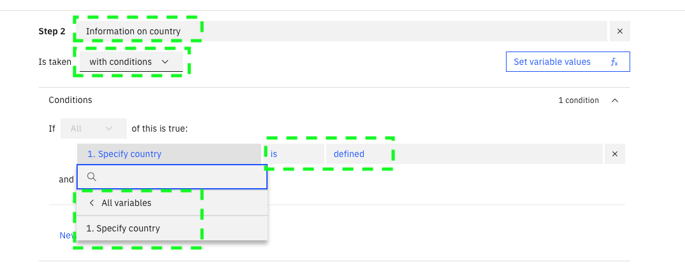

8. For what the **Assistant says**, add text `Would you like information on`, and type `$`. After you paste this, a pull-down menu appears. Click "Action step variables" and select **1. Specify country**.
   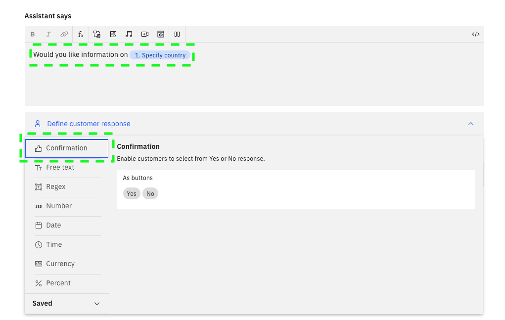
   Expand **Define customer response**, and specify that the assistant will expect a response from the user as **Confirmation**. When you click **Confirmation**, the UI shows **Yes No** below the **Assistant says** panel. When this is shown, click **New Step** to configure the next part of the Action.

9. Name the next step `No information on country required` by clicking the pencil (edit) icon. In this step, select **with conditions**. In the **Conditions**, click the first item, click "Action step variables" and select **2. Information on country**. Click the third item and select **No**.
   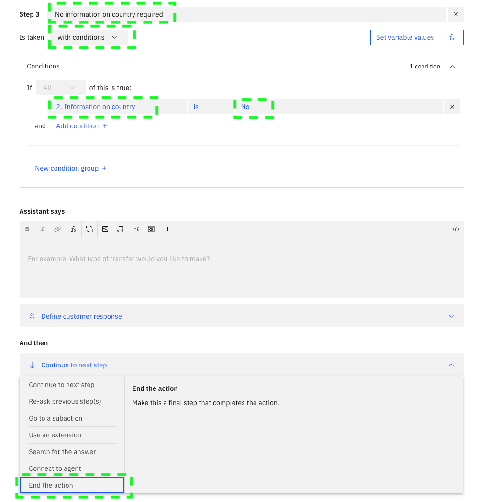
   Expand **And then**, and specify that the next step is **End the action**. When you click **End the action**, the UI shows **End the action** in the **And then** panel. When this is shown, click **New Step** to configure the next part of the Action.
This steps means a user can end the dialogue flow if they don't want information on the country specified.

10. Name the next step `Call LLM for general country information` by clicking the pencil (edit) icon. In this step, select **with conditions**. In the **Conditions**, click the first item, click "Action step variables" and select **2. Information on country**. Click the third item and select **Yes**. Click **Set variable values**, and click **Set new value**. Then, click **New session variable**.
   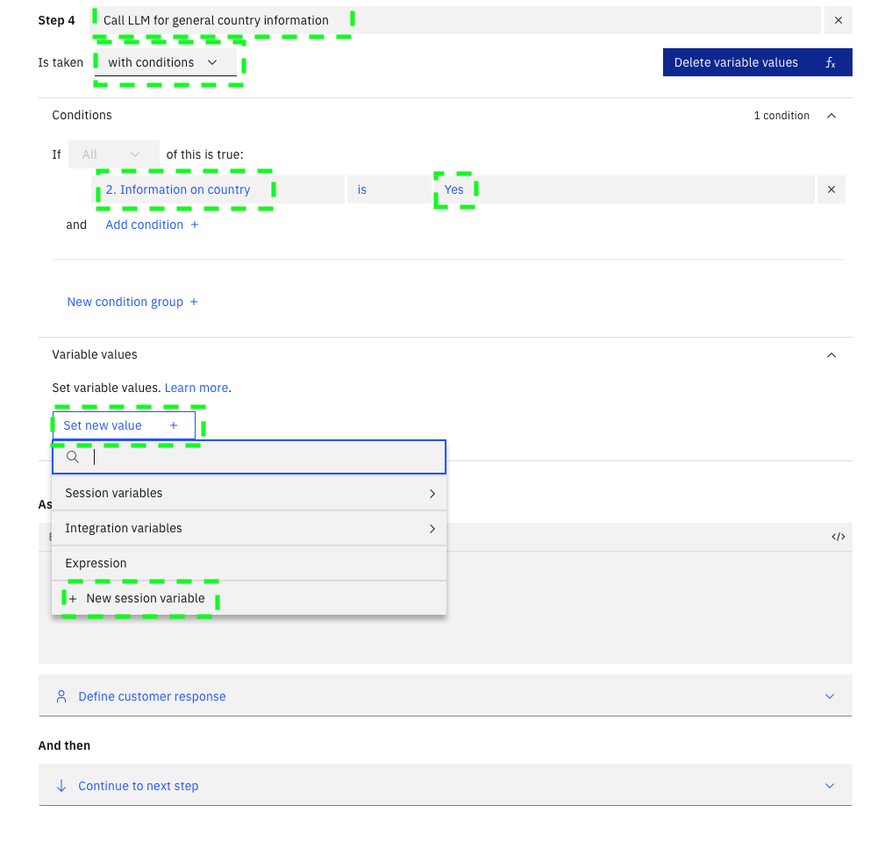

11. Call the variable `prompt` with type **free text**, and click **Apply**.
   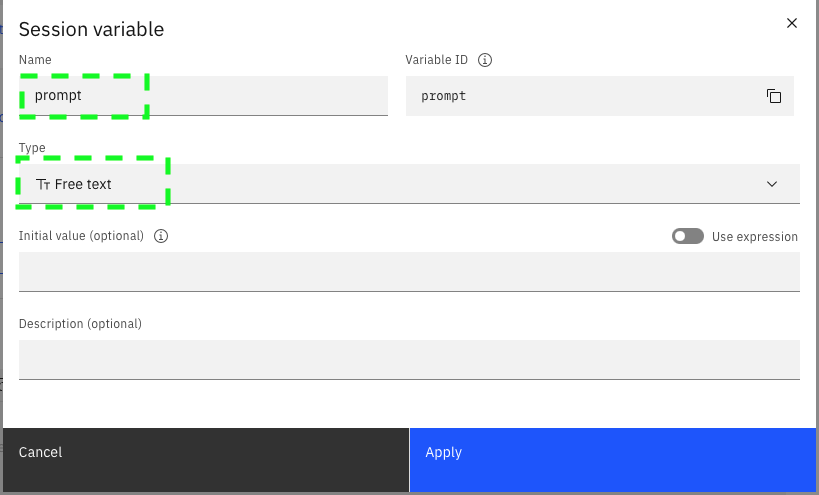

12. For the variable assignment `To`, select **Expression**, and type `"Tell me about the country "`, then `+` and finally `$`. After you paste this, a pull-down menu appears. Click "Action step variables" and select **1. Specify country**. Click **Apply**.
    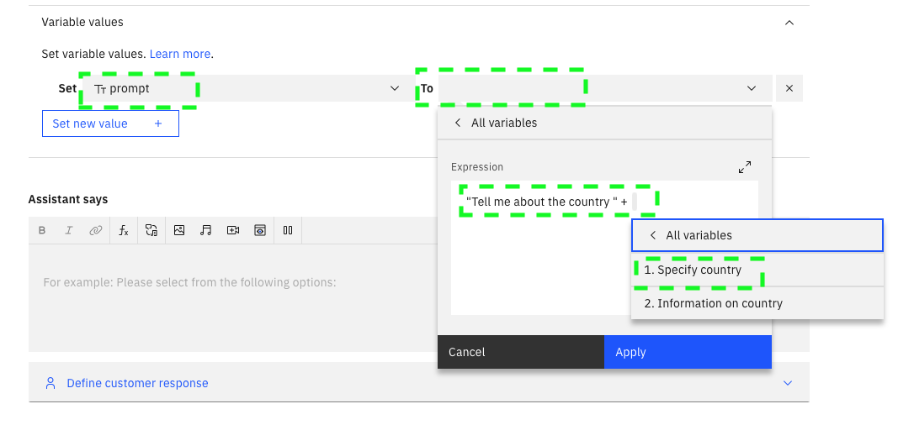

13. In the **And then** section, select **Use an extension**.
    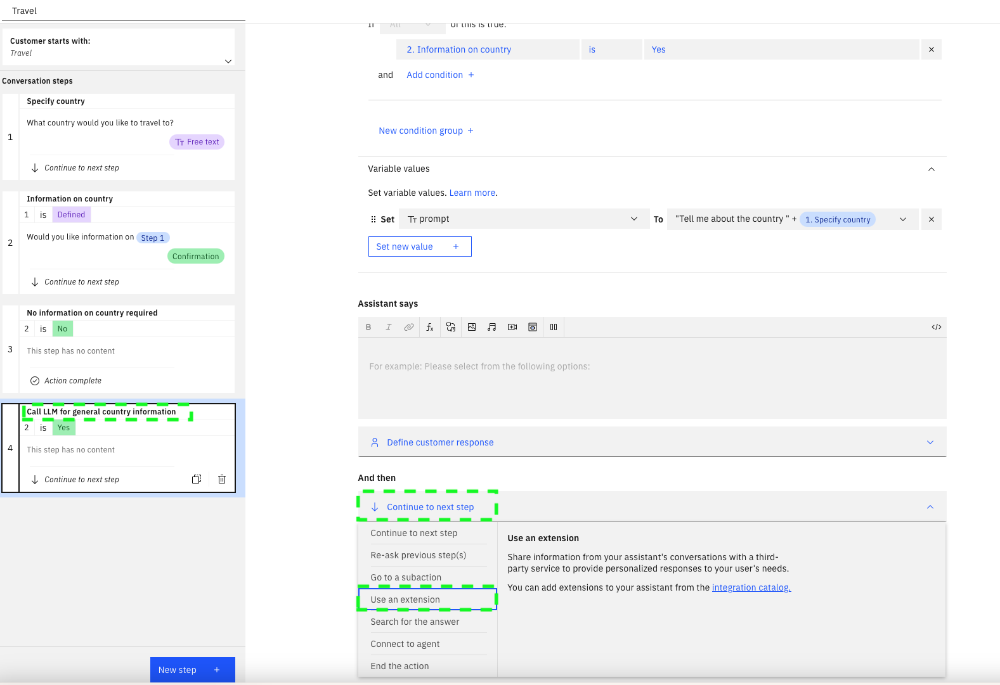

14. Select **watsonx** for the extension to use. Then, select the **Generation** operation to show the parameters that can be sent to watsonx.ai on every invocation. For version, choose **Enter text**, and then provide **2023-05-29**. For input, choose **Session Variables**, and then choose **prompt**, continuing in the same way. Set the `model_id` to **meta-llama/llama-2-70b-chat** and the `project_id` to your watsonx.ai project ID saved previously. Don't click **Apply** yet.
   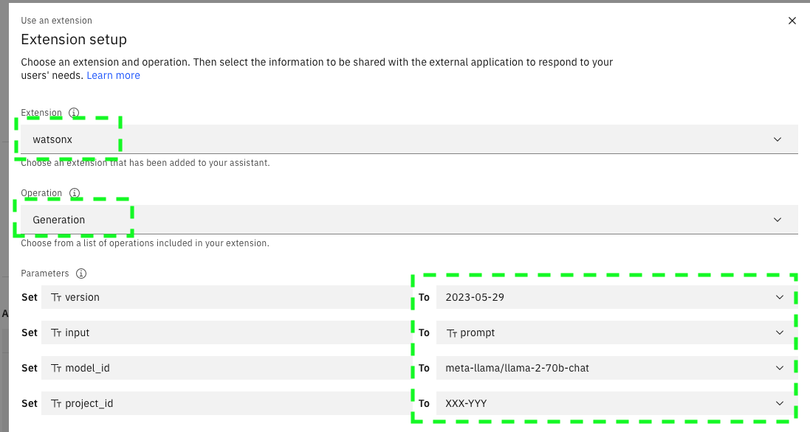

15. Expand the optional parameters. For this text generation scenario:
    * Set `parameters.temperature` to **0.7**
    * Set `parameters.max_net tokens` to **200**
    * Set `parameters.min_new_tokens` to **50**
    * Set `parameters.repetition penalty` to **2**
    * Set `parameters.decoding_method` to **sample**
    * Click **Apply**.
   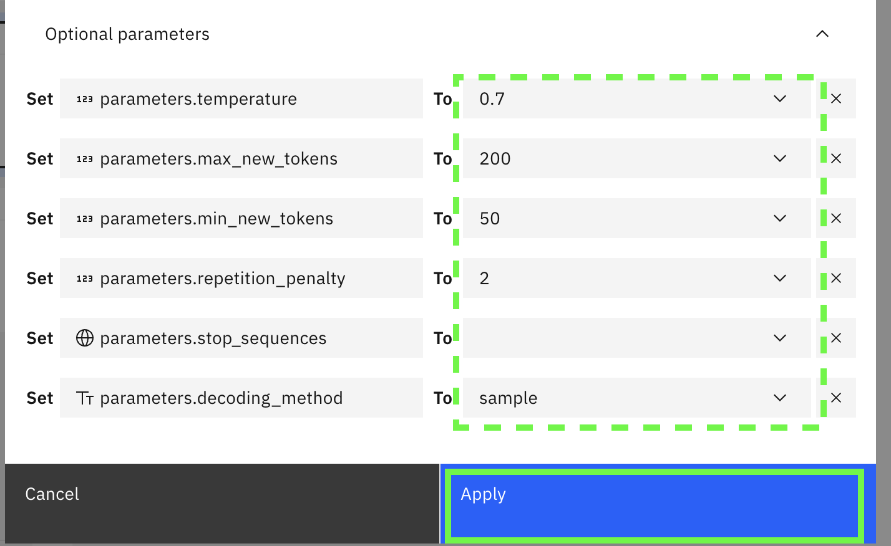

16. Click **New Step**.

17. In this step, name it `Country info response` and select **with conditions**. In the condition, click the first item, and select **watsonx (step 4)**.
    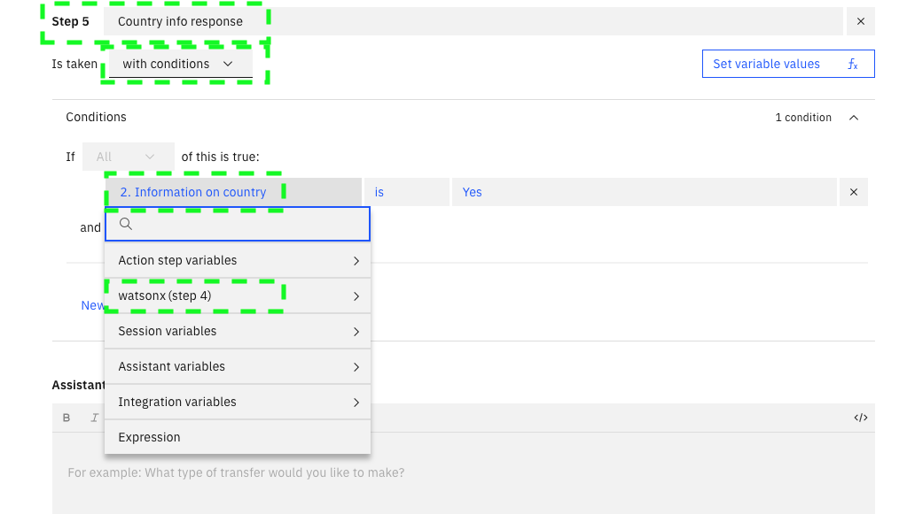

18. Select **Ran successfully**.

19. Click **Set variable values**, and click **Set new value**. Then, click **New session variable**. This is similar to variable set in #10 above.

20. Call the variable `result_country_info`, select **free text**, and click **Apply**. This is similar to #11 above.

21. For the variable assignment `To`, select **Expression**, and type `$`. After you paste this, a pull-down menu appears. Select **watsonx (step 4)**.
    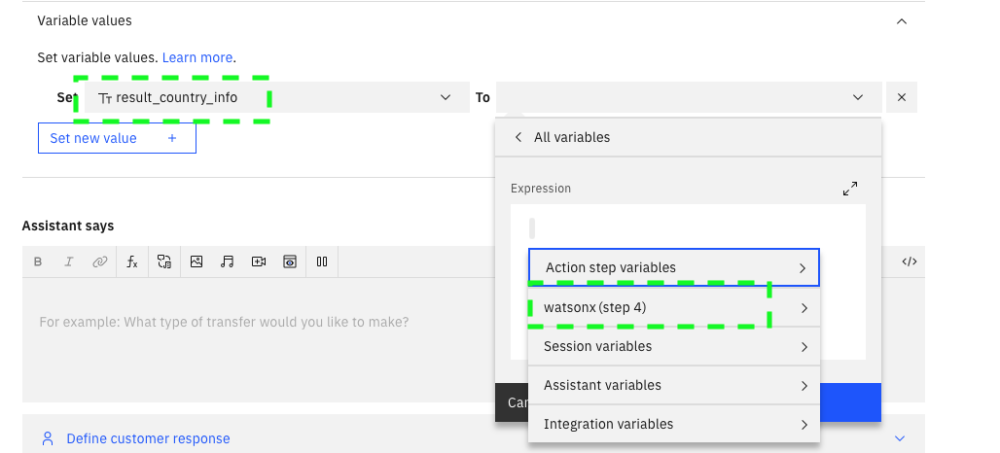
    Select **body.results**. The box fills in with the assignment for the `result_country_info` variable. Now append `[0].generated_text` to the expression and click **Apply**.
    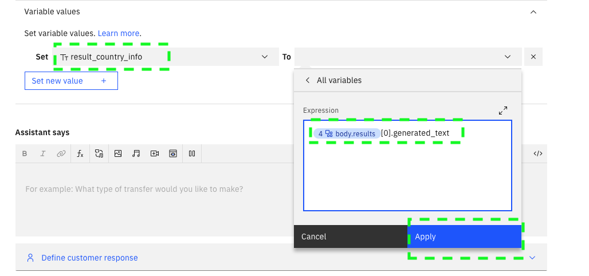

22. The full expression for the variable should be displayed, as shown in the following image.
    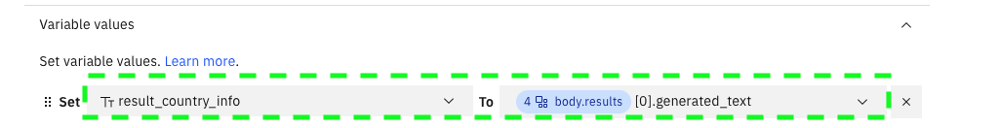

23. In the **Assistant says** panel, select **function**, and then enter `${result_country_info}`. Or, you can select **Session variables**, and then **result_country_info**.
    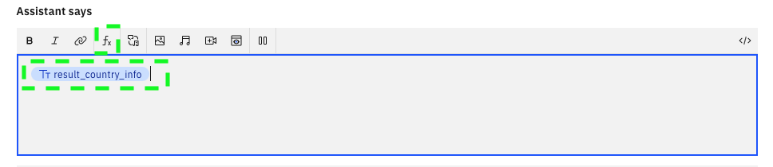
This panel will display the information to the chatbot user as returned by the LLM when inferenced. It uses the `result_country_info` variable to store the result from the LLM.

24. Click **New Step**.

25. In this step, name it `More info on country`, it prompts the user if they would like more specific information on the country as you did in #7 and #8 above. In the **Assistant says**, add text `Would you like more information on `, type `$`. After you paste this, a pull-down menu appears. Click "Action step variables" and select **1. Specify country**. Next, add text: ` that is specific to your interests?`. In **Define customer response**, specify that the assistant will expect a response from the user as **Confirmation**.
   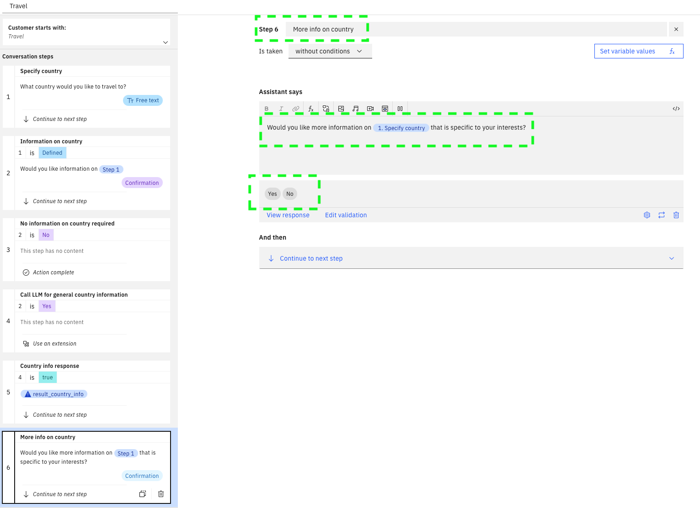

26. Click **New Step**.

27.  Name the next step `Specific interests on country` by clicking the pencil (edit) icon. In this step, select **with conditions**. In the condition, click the first item, click "Action step variables" and select **6. More info on country**. Click the third item and select **Yes**. In the **Assistant says** panel, add text `Please list your interests`. In **Define customer response**, specify that the assistant will expect a response from the user as **Free Text** input
   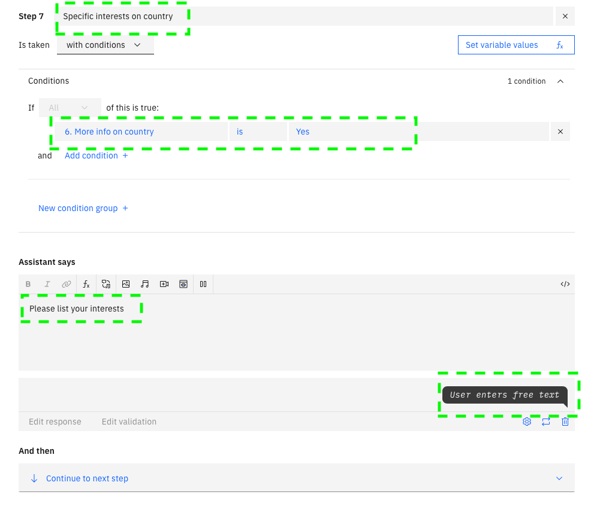

28. Click **New Step**.

29. As per #9 above, create a step (name it `No specific interests on country`) which checks if the user said **No** for more information and **End the action** in the **And then** panel.
   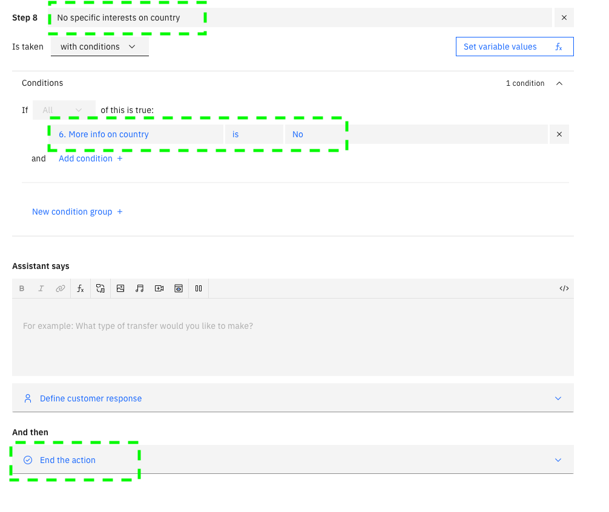

30. Click **New Step**.

31. In this step, using the list of interests from the user, add a `prompt_specific` session variable that will be used to prompt the model. Click **Apply** when variable expression complete.
   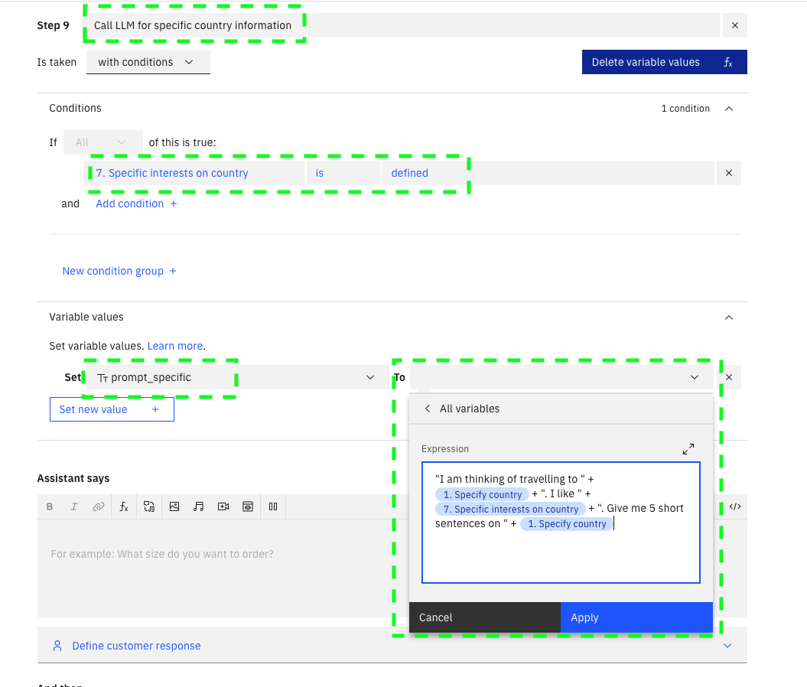

32. Select **watsonx** for the extension to use (similar to #14 and #15 above). The only difference in the parameters here is input, where you choose **Session Variables**, and then choose **prompt_specific** instead.
   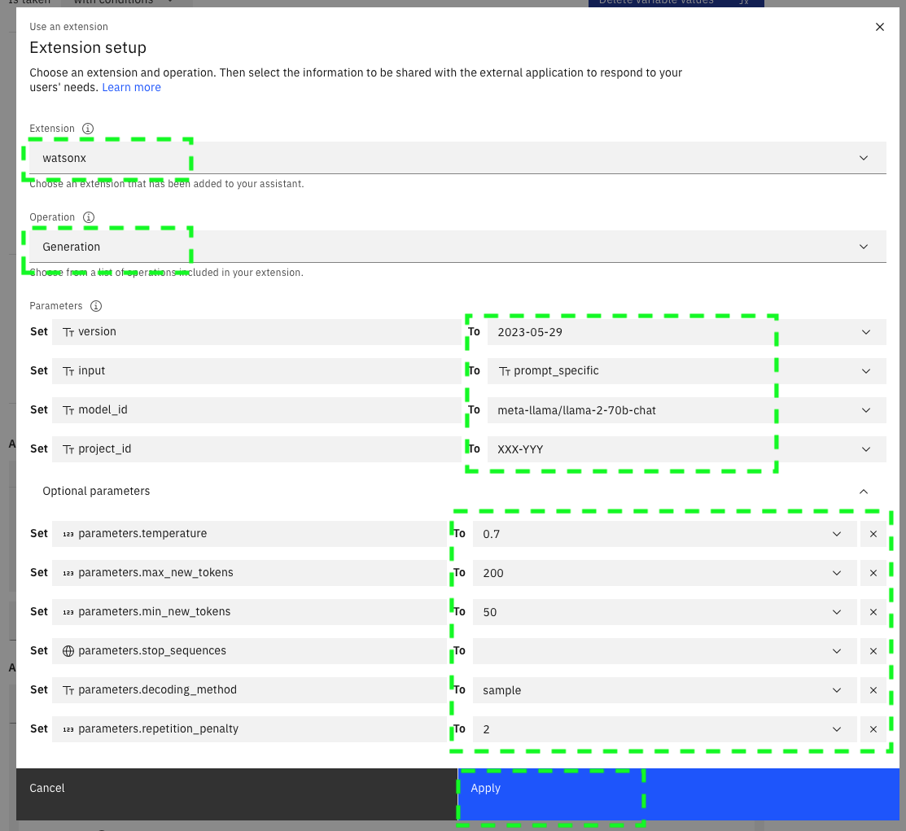
   Click **Apply**.

33. Click **New Step**.

34. In this step (name it `Country specific info response`), following similar instructions from #17 to #23. Condition is based on `watsonx (step 9)`. The new variable to create is called `result_country_specific_info` which is added to **Assistant says** to output the result to the user. In **And then**, specify that the next step is **End the action** as this is the final step.
   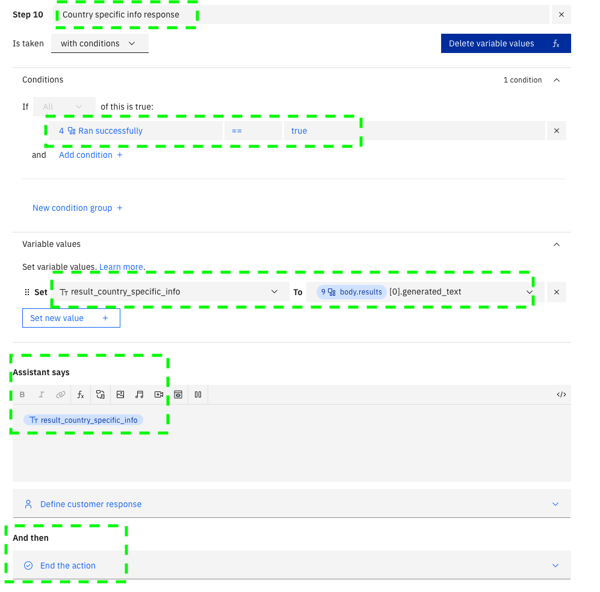

The assistant is ready to go. It's time to test it out.

### Step 7. Testing the travel app

1. Click **Preview**.

2. After the greeting, type `travel`, and send to the chatbot.

3. The chatbot replies with the prompt for the country and if you want info on it.
   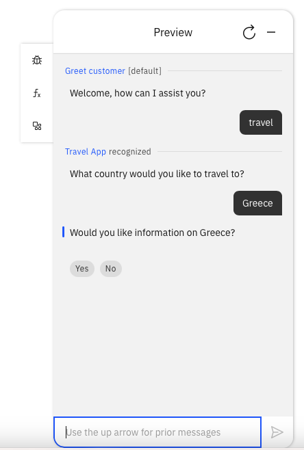

4. Click **Yes** and if everything worked, you should receive a response from the model containing the info on the country you specified.
   
You most likely will see something different if you rerun for the same country because you are using a `sampling` (versus `greedy`) decoding approach. If you don't like the response, rerun the assistant to get another message.

5. If you click **Yes** for information more specific to your interests then you will be prompted to enter your interests. Once interests are entered, if everything worked, you should receive a response from the model with more specific info on the country.
   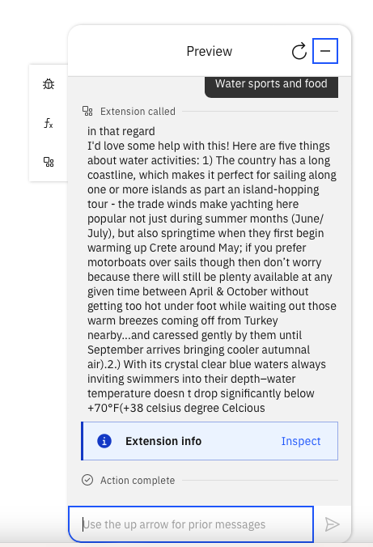

## Next Steps

Experiment in the watsonx.ai prompt lab for other scenarios using different prompts and parameters, then create new actions and adjust the parameters for the new use case. Try it out!

Continue exploring [watsonx Assistant](https://cloud.ibm.com/catalog/services/watson-assistant?cm_sp=ibmdev-_-developer-_-trial) and [watsonx.ai](https://dataplatform.cloud.ibm.com/registration/stepone?context=wx?cm_sp=ibmdev-_-developer-_-trial) to learn more features and functions.

