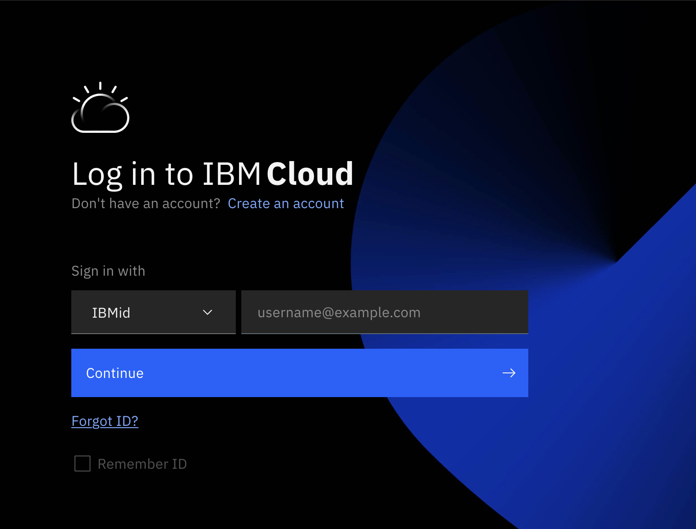
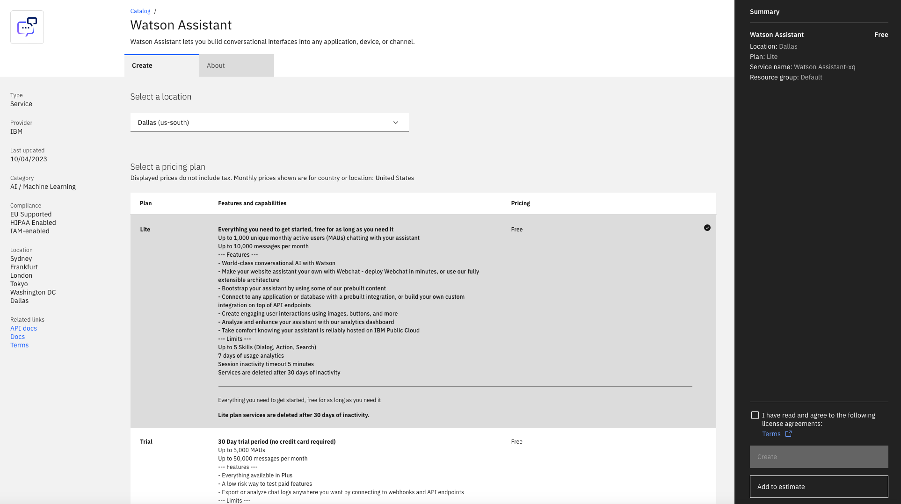
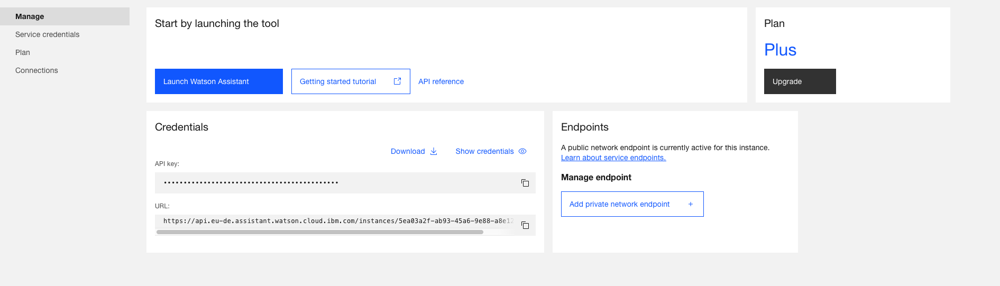
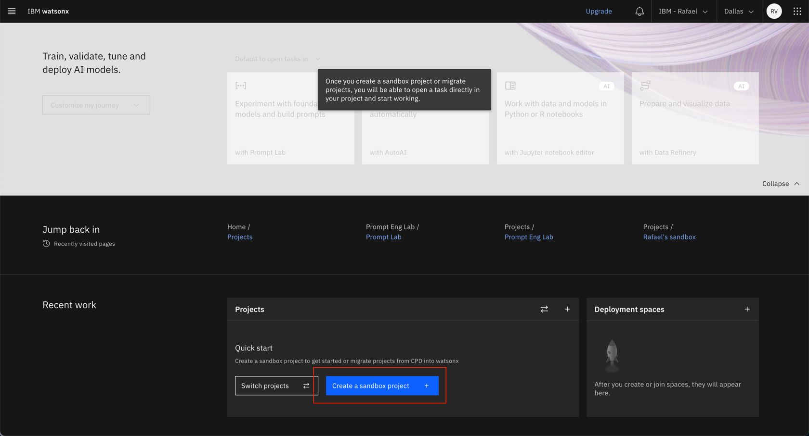
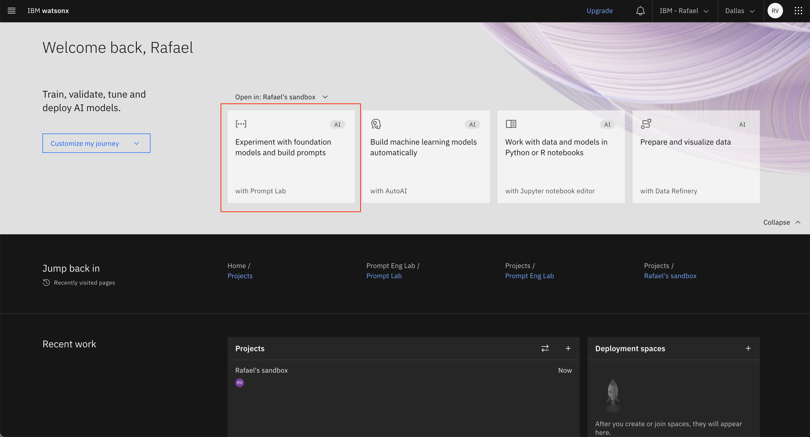

# Pre-work

This section is broken up into the following steps:

1. [Sign up for IBM Cloud](#1-sign-up-for-ibm-cloud)
1. [Create a watsonx Assistant instance](#2-create-a-watsonx-assistant-instance)
1. [Connect to watsonx.ai](#3-connect-to-watsonxai)
1. [Create a sandbox project in watsonx.ai](#4-create-a-sandbox-project-in-watsonxai)

## 1. Sign up for IBM Cloud

Ensure you have an IBM Cloud ID as services and [Large Language Models (LLMs)](https://en.wikipedia.org/wiki/Large_language_model) will be deployed on the cloud.

**Note:** You will need to be logged into IBM Cloud before continuing below.

## 2. Create a watsonx Assistant instance

You will use [watsonx Assistant](https://www.ibm.com/products/watsonx-assistant?cm_sp=ibmdev-_-developer-tutorials-_-product) to create a dialog flow and integrate an LLM to generate the travel chatbot app.

Deploy an [instance of watsonx Assistant](https://cloud.ibm.com/catalog/services/watsonx-assistant?cm_sp=ibmdev-_-developer-_-trial) if you don't have one or want to use a new one. Choose any of the service plans, including the *Lite* plan:

Once deployed, launch the Assistant so you can start using it.

## 3. Connect to watsonx.ai

You will use [watsonx.ai](https://www.ibm.com/products/watsonx-ai) for prompt tuning and [inferencing AI models](https://research.ibm.com/blog/AI-inference-explained#) in the travel chatbot app, so ensure that you can log into the UI. 

If you haven't already signed up, click "Start your free trial" and follow the instructions. You'll be able to use your free trial for this lab and further self-study, just be mindful of token limits as they vary depending on [pricing tier](https://www.ibm.com/products/watsonx-ai/pricing).

## 4. Create a sandbox project in watsonx.ai

A *project* is where you work with data and models. When you sign up for watsonx.ai, your sandbox project is created automatically, and you can start working with it immediately. If you don't have a project, you can manually create one too.

Once you have a project, you'll be able to open the Prompt Lab, where you can experiment with prompting different foundation models, explore sample prompts, and save and share your best prompts.

You are now ready to move on to the first lab where we'll use prompt engineering of foundation models to better understand what model and input prompt we need to be able to use the model in our application to return the information we require. In the subsequent lab, we will then integrate the learnings from the first lab to call the model in the dialog flow of our travel chatbot application.
